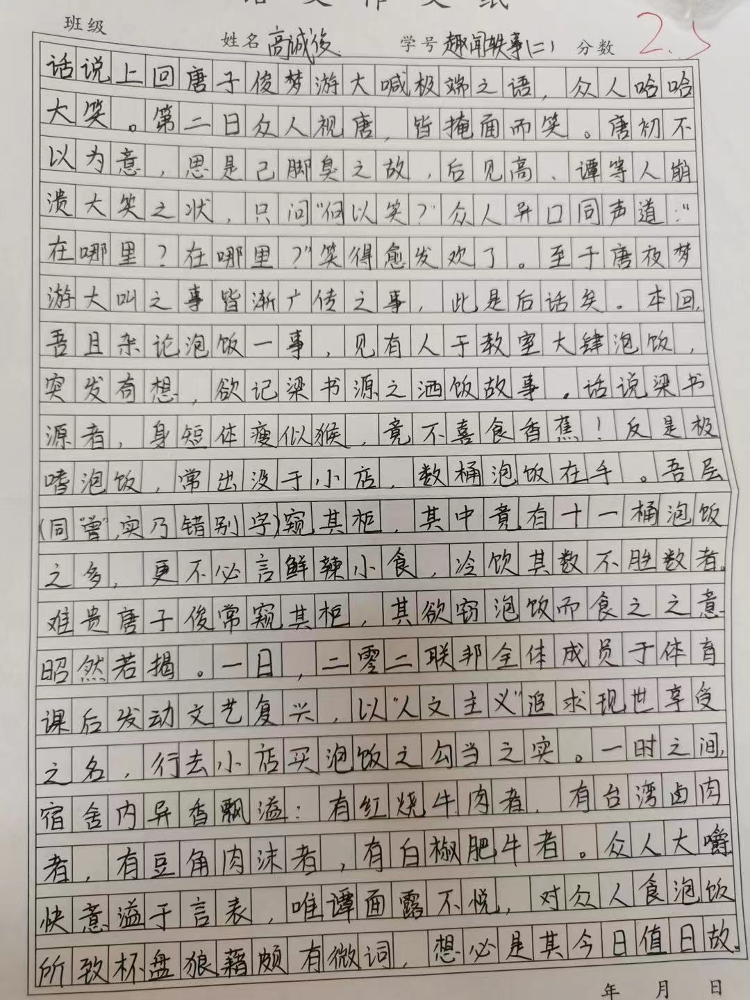

title: 趣闻轶事（二）

# 趣闻轶事（二） $\scriptsize{高诚俊}$

话说上回唐子俊梦游大喊极端之语，众人哈哈大笑。第二日众人视唐，皆掩面而笑。唐初不以为意，思是脚臭之故，后见高、谭等人崩溃大笑之状，只问 “何以笑？”。众人异口同声道：“在哪里？在哪里？” 笑得愈发欢了。

至于唐夜梦游大叫之事皆渐广传之事，此是后话矣。本回，吾且杂论泡饭一事，见有人于教室大肆泡饭，突发奇想，欲记梁书源之洒饭故事。

话说梁书源者，身短体瘦如猴，竟不喜食香蕉！反是极嗜泡饭，常出没于小店，数桶泡饭在手。吾层[^1]窥其柜，其中竟有十一桶泡饭之多，更不必言鲜辣小食，冷饮其数不胜数者。难贵唐子俊常窥其柜，其欲窃泡饭而食之之意昭然若揭。

一日，二零二联邦全体成员于体育课后发动文艺复兴，以 “人文主义” 追求现世享受之名，行去小店买泡饭之勾当之实。一时之间，宿舍内异香飘溢：有红烧牛肉者，有台湾卤肉者，有豆角肉沫者，有白椒肥牛者。

众人大嚼快意溢于言表，唯谭面露不悦，对众人食泡饭所致杯盘狼藉颇有微词，想必是其今日值日故。

[^1]: 同 “曾”，实乃错别字。

??? abstract "原文件"
	