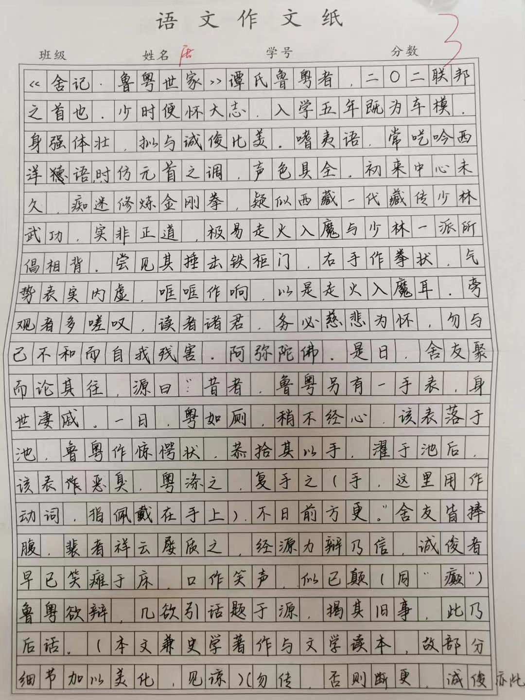

title: 舍记 · 鲁粤世家

# 舍记 · 鲁粤世家[^1] $\scriptsize{唐子俊}$

谭氏鲁粤者，二〇二联邦之首也。少时便怀大志，入学五年既为车模，身强体壮，拟与诚俊比美。嗜夷语，常呓吟西洋语，时仿元首之调，声色具全。

初来中心未久，痴迷修炼金刚拳，疑似西藏一代藏传少林武功，实非正道，极易走火入魔与少林一派所倡相背。尝见其捶击铁柜门，右手作拳状，气势表实内虚，框框作响，以是走火入魔耳。旁观者多嗟叹，读者诸君，务必慈悲为怀，勿与己不和而自我残害，阿弥陀佛。

是日，舍友聚而论其往，源曰：“昔者，鲁粤另有一手表，身世凄戚。一日，粤如厕，稍不经心，该表落于池。鲁粤作惊愕状，恭拾其以手。濯于池后，该表恶臭，粤涤之，复手之[^2]，不日前方更。” 舍友皆捧腹，裴者祥云屡质之，经源力辩乃信。诚俊者早已笑摊于床，口作笑声，似已颠[^3]。鲁粤欲辩，几欲引话题于源，揭其旧事，此乃后话。

（勿传，否则断更，诚俊亦此）[^4]

[^1]: 本文兼史学著作与文学读本，故部分细节加以美化，见谅。
[^2]: 这里用作动词，指佩戴在手上。
[^3]: 同 “癫”。
[^4]: 语文老师曾违背唐子俊、高诚俊二人的意愿，将他们在练字纸上创作的文章上传至家长群，于是有了这一警告。——编者注

??? abstract "原文件"
	