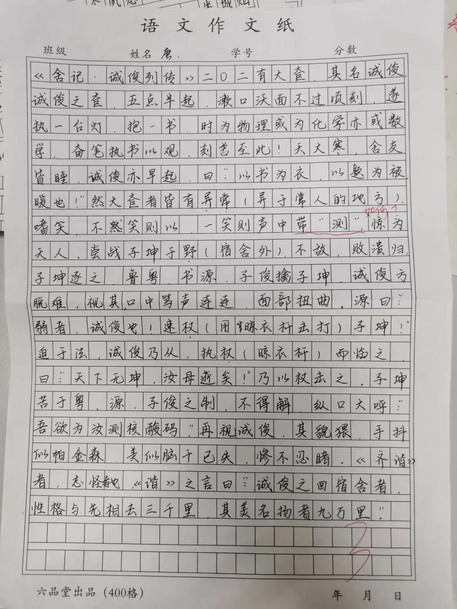

title: 舍记 · 诚俊列传

# 舍记 · 诚俊列传 $\scriptsize{唐子俊}$

二〇二有大奆，其名诚俊。

诚俊之奆，五点半起，漱口沃面不过顷刻，遂执一台灯，抱一书，时为物理或为化学亦或数学，奋笔执书以观，刻苦至此！天大寒，舍友皆睡，诚俊亦早起，曰：“以书为衣，以题为被，暖也！” 

然大奆者皆有异常[^1]。嗜笑，不笑则以[^2]，一笑则声中带 “测”，惊为天人。

尝战子坤于野（宿舍外）[^3]，不敌，败溃归。子坤逐之，鲁粤、书源、子俊擒子坤，诚俊方脱难。视其口中骂声连连，面部扭曲，源曰：“弱者，诚俊也！速仗[^4]子坤！” 迫于法，诚俊乃从。执仗[^5]而临之，曰：“天下无坤，汝母逝矣！” 乃以仗击之。子坤苦于粤、源、子俊之制，不得懈，纵口大呼：“吾欲为汝测核酸码。” 再视诚俊，其貌猥，手抖似帕金森，美似脑干已失，惨不忍睹。

《齐谐》者，志怪者也。《谐》之言曰：“诚俊之回宿舍者，性格与先相去三千里，其美名扬者九万里。”

[^1]: 异于常人的地方。
[^2]: 通 “已”。——编者注
[^3]: 为什么要强调在宿舍外呢？因为大家都是守法公民，不可以违背[击剑和平区](/history/Dorm-War-I/#召开议会)的共识。——编者注
[^4]: 用晾衣杆击打。
[^5]: 晾衣杆。

??? abstract "原文件"
	