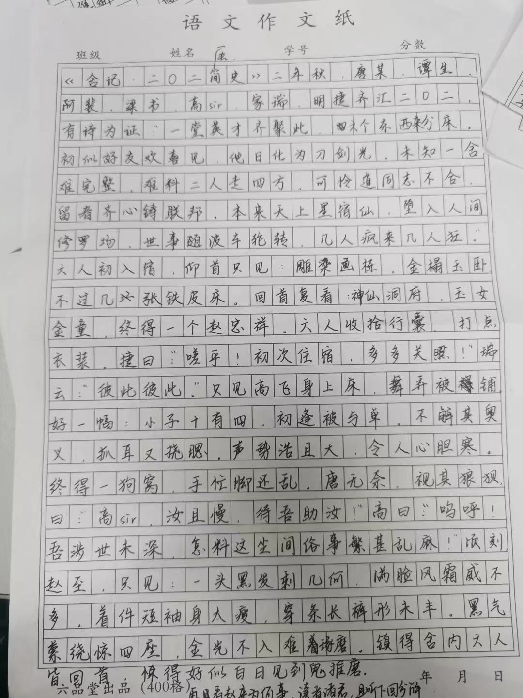

title: 舍记 · 二〇二简史

# 舍记 · 二〇二简史 $\scriptsize{唐子俊}$

二年[^1]秋，唐某、谭生、阿裴、梁书、高 sir、家瑞、明捷齐汇二〇二。有诗为证：

> 一堂英才齐聚此，六个东西来分床。  
> 初似好友欢喜见，他日化为刀剑光。  
> 未知一舍难完整，难料二人走四方。  
> 可怜道同志不合，留者齐心铸联邦。  
> 本来天上星宿仙，坠入人间修罗场。  
> 世事随波车轮转，几人疯来几人狂。  

六人初入宿，仰首只见：雕梁画栋，金榻玉卧，不过几张铁皮床。回首复看：神仙洞府，玉女金童，终得一个赵忠祥。六人收拾行囊，打点衣装。

捷曰：“嗟乎！初次住宿，多多关照！” 瑞云：“彼此彼此。”

只见高飞身上床，舞弄被铺，好一幅：

> 小子十有四，初逢被与单。  
> 不解其奥义，抓耳又挠腮。  
> 声势浩且大，令人心胆寒。  
> 终得一狗窝，手忙脚还乱。  

唐无奈，视其狼狈，曰：“高 sir，汝且慢，待吾助汝！”

高曰：“呜呼！吾涉世未深，怎料这尘间俗事繁甚乱麻！”

顷刻，赵至，只见：

> 一头黑发剩几何，满脸风霜威不多。  
> 着件短袖身太瘦，穿条长裤形未丰。  
> 黑气萦绕惊四座，金光不入难琢磨。  
> 镇得舍内六人皆回首，惊得好似白日见到鬼推磨。  

再看赵来为何事，读者诸君，且听下回分解。

[^1]: 这里指 2022 年。——编者注

??? abstract "原文件"
	